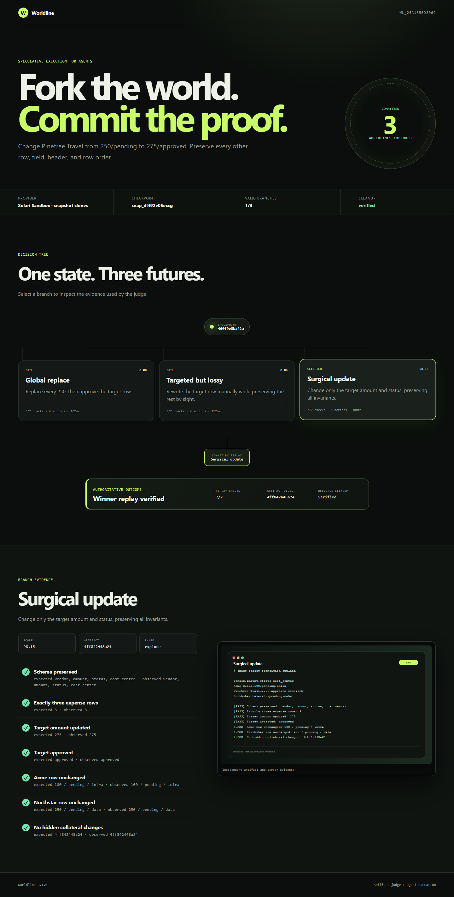

# Worldline

**Speculative execution for computer-use agents.** Worldline checkpoints an
environment, tries several candidate plans from the exact same state, verifies
their effects independently, and commits only the winning plan by replaying it
from the checkpoint.

> Agents should not guess when they can fork the world.



The repository includes a deterministic offline demo and a sanitized evidence
bundle from a real Solari Sandbox run. After installing below, review the live
proof without credentials:

```bash
python -m worldline serve --directory proof/live
```

## The first task

The bundled expense-ledger fixture asks an agent to approve one vendor and
change one amount without touching anything else. Three plausible strategies
compete:

1. A global replacement that also changes another vendor.
2. A targeted edit that accidentally damages an unrelated field.
3. A surgical update that preserves every invariant.

Worldline scores the resulting artifact rather than trusting the plan's own
description. Required checks are hard gates; latency and action count break ties
between valid branches. The selected branch is then replayed from the original
checkpoint and verified again before it is considered committed.

## Run the offline demo

```bash
cd applications/worldline
python -m venv .venv
source .venv/bin/activate
python -m pip install .
python -m worldline demo
python -m worldline serve
```

On Windows PowerShell, replace the activation command with
`.venv\Scripts\Activate.ps1`; the remaining commands are the same.

The report is written to `artifacts/latest/`. The offline fixture exercises the
same engine, verifier, report generator, and commit-by-replay path as live mode,
but uses deterministic local branch results and does not require credentials.

## Run against live Solari

From `applications/worldline`, copy `.env.example` to `.env`, add your Solari
API key, then:

```bash
python -m worldline live --surface sandbox
python -m worldline serve
```

The proven `--surface sandbox` path checkpoints a prepared microVM and creates
an independent clone for every candidate plus the winner replay. Every resulting
artifact is read through Solari's filesystem channel and judged outside the
candidate process.

`--surface auto` is the default. Free accounts support one concurrent desktop.
The September 1 run received `Desktop requires a paid plan`; the maintainer
later clarified that this was misleading and suggested unavailable desktop host
capacity as the cause. That cause was not independently confirmed. Auto mode
retains a narrow fallback for this legacy error and runs a live sandbox tournament;
other errors still propagate. This is not a statement about desktop entitlement.
The fallback uses real microVMs: it checkpoints a prepared base, destroys
that worker, and starts every candidate from a fresh `fromSnapshot` clone.
Every clone gets independent artifact verification and explicit destruction;
only the GUI action channel is absent. Use `--surface desktop` to require the
GUI backend or `--surface sandbox` to choose the free-tier backend directly.
The Desktop adapter edits the ledger through Mousepad using the desktop
clipboard, mouse, and keyboard, reads the saved artifact independently, and
destroys the desktop in cleanup even when a branch errors.

## Test

```bash
python -m unittest discover -s tests -v
```

## Evidence contract

Every run records:

- the base-state fingerprint;
- branch action traces and duration;
- required and advisory invariant checks;
- artifact fingerprints and screenshots;
- deterministic branch scores;
- the selected winner and replay result;
- whether the remote environment was cleaned up.

The report never stores the Solari API key. Live session and snapshot identifiers
are shortened before they enter the artifact.

## Proven live run

The committed bundle under [`proof/live`](proof/live) records run
`wl_25a1856d806c`. Three strategies ran in isolated snapshot clones; the
`surgical-update` strategy was the only eligible branch and passed again when
replayed in a fourth clean clone. Its downloaded CSV matches the recorded
SHA-256 `4ff842448a24d98fcb1cfdc647b05a717a1c75e80066bc5da3ed7eb1c6d42063`.
Post-run inventory found zero sessions and zero snapshots.

The committed proof stores evidence only. `worldline serve --directory proof/live`
serves the shared packaged viewer without modifying that evidence. New run exports
still include the viewer files so they can be served independently.

For the minimal snapshot primitive without the tournament or UI, see
[`sandbox-snapshot-fork-py`](../../examples/sandbox-snapshot-fork-py).

Worldline was designed, implemented, and iteratively tested with OpenAI Codex.
